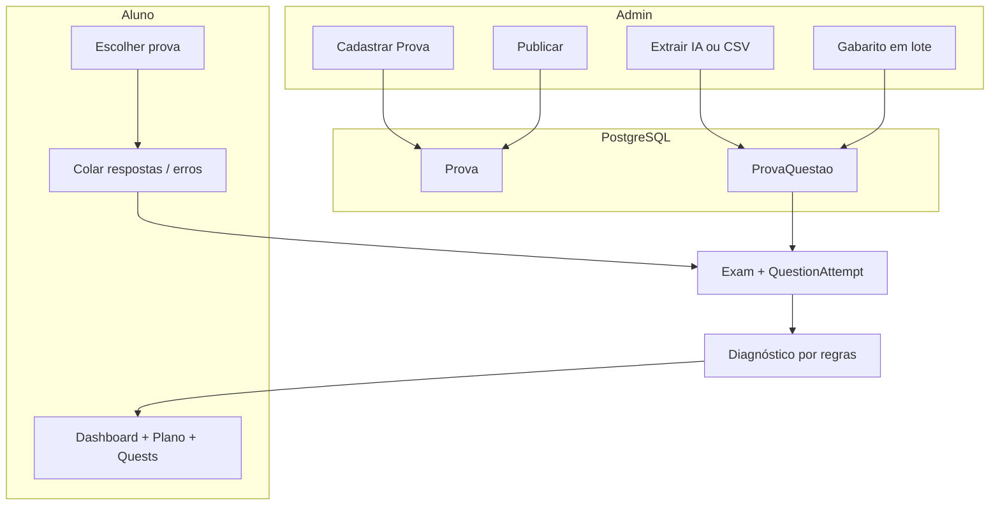

# Coach Vestibular — Documentação completa do projeto

> **Última atualização:** maio/2026  
> **Repositório:** https://github.com/ftsmazzo/coach-vestibular  
> **Pasta local (exemplo):** `C:\Users\fred\coach-vestibular`

Este arquivo consolida **o que pensamos**, **o que construímos** e **como o sistema funciona hoje**, incluindo um **resumo da conversa no Cursor** para você retomar o trabalho em outro PC.

---

## Índice

1. [Visão e propósito](#1-visão-e-propósito)
2. [Para quem é e tom do produto](#2-para-quem-é-e-tom-do-produto)
3. [Decisões de produto (o que acordamos)](#3-decisões-de-produto-o-que-acordamos)
4. [Stack e arquitetura técnica](#4-stack-e-arquitetura-técnica)
5. [Modelo de dados](#5-modelo-de-dados)
6. [Fluxo do admin (banco de provas)](#6-fluxo-do-admin-banco-de-provas)
7. [Fluxo do aluno (registrar simulado)](#7-fluxo-do-aluno-registrar-simulado)
8. [Extração com IA e agente GPT](#8-extração-com-ia-e-agente-gpt)
9. [Diagnóstico, plano e quests](#9-diagnóstico-plano-e-quests)
10. [Deploy (EasyPanel + VPS)](#10-deploy-easypanel--vps)
11. [Variáveis de ambiente](#11-variáveis-de-ambiente)
12. [Contas demo e beta](#12-contas-demo-e-beta)
13. [Mapa de arquivos importantes](#13-mapa-de-arquivos-importantes)
14. [Problemas que já resolvemos](#14-problemas-que-já-resolvemos)
15. [Próximos passos sugeridos](#15-próximos-passos-sugeridos)
16. [Resumo do chat (histórico Cursor)](#16-resumo-do-chat-histórico-cursor)
17. [Como continuar em outro PC](#17-como-continuar-em-outro-pc)

---

## 1. Visão e propósito

O **Coach Vestibular** é uma plataforma web para apoiar estudantes de pré-vestibular (foco **medicina**), começando pela sua enteada e expandindo para um **beta fechado** (3–5 alunos).

**Problema que resolve:** depois de um simulado, é inviável classificar manualmente dezenas ou centenas de questões (matéria, assunto, habilidade) só para ter um diagnóstico útil.

**Solução:** o admin monta um **banco de provas** (uma linha por questão, já classificada). O aluno só escolhe **qual prova fez** e informa **suas respostas** ou **quais errou**. O sistema compara com o gabarito cadastrado e gera diagnóstico, plano semanal e quests com linguagem empática (sem punição).

---

## 2. Para quem é e tom do produto

| Público | Papel |
|---------|--------|
| **Admin (você)** | Cadastra provas, extrai/classifica questões, publica, atualiza gabarito |
| **Aluno** | Registra tentativa, vê dashboard, plano, quests, check-in emocional |
| **Beta** | Acesso por convite (`InviteCode`) |

**Tom:** acolhedor, foco em progresso, modo recuperação quando o simulado foi pesado — nunca culpabilizar o estudante.

---

## 3. Decisões de produto (o que acordamos)

### 3.1 Um app, um backend

- **Next.js único** no EasyPanel (não dois backends separados).
- **PostgreSQL** em produção; SQLite só para dev local opcional.

### 3.2 Banco de provas (pivot central)

Rejeitamos o fluxo em que o aluno classifica questão a questão (~60+ por simulado).

**Modelo correto:**

1. **Prova** = registro único (vestibular, ano, dia, caderno, total esperado).
2. **ProvaQuestao** = uma linha por questão com classificação pedagógica.
3. **Aluno** escolhe a prova e cola respostas → sistema cruza com gabarito.

### 3.3 Metadados da prova ≠ dados por questão

Decisão explícita na conversa:

| Onde | O que guarda |
|------|----------------|
| Tabela **Prova** | Nome (gerado), banca, tipo, ano, dia, caderno, descrição, publicada, gabarito completo |
| Tabela **ProvaQuestao** | Número, área/bloco (ENEM), matéria, assunto, conhecimento, dificuldade, observações, gabarito |

A **IA não repete** “UFU 2026-2” ou “Azul” em cada linha — isso já está no cadastro da prova.

**Nome automático:** `Banca — Ano — Dia X — Caderno` (ex.: `ENEM — 2025 — Dia 1 — Azul`).

### 3.4 Gabarito só com ação do admin

- **Extração IA:** classifica matéria/assunto/conhecimento; **nunca** grava gabarito.
- **Gabarito oficial:** seção “Atualizar gabarito em lote” (`1,C` por linha) ou CSV com coluna Gabarito no import manual.
- Motivo: evitar gabarito inventado ou extraído de material misto (prova + folha de respostas).

### 3.5 Planilha do GPT como contrato, não como entrada manual

Você usa um **Agente GPT** para gerar CSV/planilha a partir do PDF. O app aceita esse CSV ou extrai direto do PDF com OpenAI — mesma estrutura de colunas por questão.

### 3.6 Agente GPT externo + app

O prompt longo do seu agente (Role, Core Workflow, Classification Rules) foi usado para **refinar o system prompt** da extração no app. O agente continua útil para gerar CSV offline; o app é a fonte de verdade no banco.

---

## 4. Stack e arquitetura técnica

| Camada | Tecnologia |
|--------|------------|
| Frontend | Next.js 16 (App Router), React 19, Tailwind CSS 4 |
| API | Route Handlers em `src/app/api/` |
| ORM | Prisma 7 + PostgreSQL |
| Auth | JWT (cookie), roles `ADMIN` / `STUDENT` |
| IA | OpenAI Chat Completions (`gpt-4o-mini`), JSON estruturado |
| PDF | `pdf-parse` v2 (`PDFParse.getText()`) |
| Deploy | Docker + EasyPanel (VPS) |

### Diagrama geral



---

## 5. Modelo de dados

### Entidades principais

| Modelo | Função |
|--------|--------|
| `User` | Aluno ou admin; `vestibularAlvo`, `metaProva` |
| `Prova` | Catálogo de provas/simulados |
| `ProvaQuestao` | Banco de questões da prova |
| `Exam` | Tentativa do aluno (vinculada a `provaId`) |
| `QuestionAttempt` | Acerto/erro por número; link opcional `provaQuestaoId` |
| `DiagnosticSnapshot` | Resultado do motor de diagnóstico (JSON) |
| `StudyPlan` | Plano semanal (JSON) |
| `Quest` | Tarefas derivadas do plano |
| `EmotionalLog` | Check-in 1–5 no registro do simulado |
| `InviteCode` | Beta fechado |

### Campos importantes em `Prova`

```text
nome            → gerado: buildProvaNome(banca, ano, dia, caderno)
banca           → ENEM, UFU, Fuvest...
tipo            → ENEM_OFICIAL | SIMULADO | VESTIBULAR | OUTRO
ano, dia, caderno
totalQuestoes   → sincronizado com quantidade real de ProvaQuestao
publicada       → aluno só vê se true
gabaritoCompleto → true quando todas as questões têm gabarito
```

### Campos importantes em `ProvaQuestao`

```text
numero, areaBloco, materia, assunto, conhecimentoExigido,
nivelDificuldade, observacoes, gabarito (null até admin preencher)
```

### Migrations (ordem)

1. `20260520142524_init` — base
2. `20260520160000_prova_banco_questoes` — Prova + ProvaQuestao
3. `20260520170000_prova_questao_campos_ia` — dificuldade, observações
4. `20260520180000_prova_questao_sem_caderno` — remove `caderno` da questão; adiciona `areaBloco`

---

## 6. Fluxo do admin (banco de provas)

### URLs

| Rota | Função |
|------|--------|
| `/admin/provas` | Listar e criar provas |
| `/admin/provas/[id]` | Extrair IA, CSV, gabarito, tabela de questões |
| `/admin/convites` | Convites beta |

### Passo a passo recomendado

1. **Criar prova** — preencher banca, ano, dia, caderno, tipo, total esperado. Nome é gerado na prévia.
2. **Classificar questões** (uma das opções):
   - **Extração IA:** PDF ou texto → Pré-visualizar → Aplicar
   - **Importar CSV** do GPT (`docs/templates/prova-questoes.csv`)
3. **Revisar** tabela (matéria, assunto, área/bloco).
4. **Gabarito em lote** quando tiver o oficial (`numero,letra` por linha).
5. **Publicar** para alunos.

### APIs admin

| Método | Rota | Uso |
|--------|------|-----|
| GET/POST | `/api/admin/provas` | Listar / criar |
| GET/PATCH/DELETE | `/api/admin/provas/[id]` | Detalhe / metadados / excluir |
| POST | `/api/admin/provas/[id]/questoes` | Import CSV |
| POST | `/api/admin/provas/[id]/extrair` | IA (multipart PDF/texto) |
| PATCH | `/api/admin/provas/[id]/gabarito` | Gabarito em lote |

### CSV — colunas por questão

```text
Número da Questão, Área/Bloco, Matéria, Assunto,
Habilidade/Conhecimento Exigido, Nível de Dificuldade, Observações, Gabarito
```

Colunas antigas `Prova` e `Caderno` no CSV do GPT são **ignoradas** (compatibilidade).

---

## 7. Fluxo do aluno (registrar simulado)

### URL: `/simulados/novo`

1. Escolhe **qual prova** (dropdown com nome gerado, ex.: `ENEM — 2025 — Dia 1 — Azul`).
2. Informa data e check-in emocional (1–5).
3. Modo **respostas** (sequência A–E) ou **apenas erros** (lista de números).
4. POST `/api/exams/from-prova` → cria `Exam`, compara com `ProvaQuestao.gabarito`, gera diagnóstico e plano.

O aluno **não** classifica matéria/tema manualmente nesse fluxo principal.

---

## 8. Extração com IA e agente GPT

### Pipeline no app

```text
PDF → pdf-parse (texto) → OpenAI (JSON) → prévia admin → ProvaQuestao
```

Arquivos:

- `src/lib/pdf-text.ts` — leitura PDF (v2 API)
- `src/lib/ai-extract-prova.ts` — prompt + chunks + validação Zod
- `src/app/api/admin/provas/[id]/extrair/route.ts`

### Configuração

```env
OPENAI_API_KEY=sk-...
OPENAI_MODEL=gpt-4o-mini
```

Sem chave: use CSV do agente GPT.

### Prompt do seu agente GPT (para CSV offline)

Alinhe o agente para **não** incluir nome da prova/caderno por linha e **não** preencher gabarito salvo que seja material oficial de gabarito:

```text
Analise o caderno [PDF].
A prova já está cadastrada como: [NOME GERADO NO APP].

Gere CSV:
Número da Questão,Área/Bloco,Matéria,Assunto,Habilidade/Conhecimento Exigido,Nível de Dificuldade,Observações,Gabarito

Uma linha por questão. Não repita nome da prova nem caderno nas linhas.
Deixe Gabarito vazio (será preenchido pelo admin no app).
```

### Limitações conhecidas

| Situação | Comportamento atual | Evolução |
|----------|---------------------|----------|
| PDF só imagem (escaneado) | Texto vazio | OCR / Vision API |
| ENEM 180 questões | Chunks de ~14k caracteres | Melhorar merge e validação de contagem |
| Gabarito no PDF de provas | IA ignorada; se já gravou antes, reaplicar extração ou lote | Botão “limpar gabaritos” (futuro) |

Documentação técnica: `docs/EXTRACAO-IA.md`, `docs/ARQUITETURA-PROVA.md`.

---

## 9. Diagnóstico, plano e quests

### Motor de diagnóstico (`src/lib/diagnosis.ts`)

- Baseado em **regras** (taxonomia ENEM + foco medicina em `data/`).
- Usa matéria/assunto da `ProvaQuestao` mapeados via `prova-catalog.ts`.
- Tipos de erro: `base_teorica`, `interpretacao`, `atencao`, `tempo`.
- **Modo recuperação** quando check-in baixo ou desempenho muito fraco.

### Plano e quests

- `study-plan.ts` gera itens semanais a partir dos focos.
- Quests com mensagens de recompensa template (`seed` / templates empáticos).
- Narrativa IA opcional: `/api/ai/narrative` (Fase 2, com guardrails).

---

## 10. Deploy (EasyPanel + VPS)

Guia detalhado: **`docs/DEPLOY-EASYPANEL.md`**

### Resumo

1. Serviço **PostgreSQL** na rede interna Docker.
2. App **Coach Vestibular** build via `Dockerfile` na raiz.
3. Porta **3000**, `HOSTNAME=0.0.0.0`.
4. Entrypoint roda `prisma migrate deploy` antes do `next start`.
5. `RUN_SEED=true` **apenas no primeiro deploy**.

### Armadilhas já vistas

| Erro | Causa | Solução |
|------|-------|---------|
| Build falha `prisma generate` | `npm ci` antes de copiar `prisma/` | Dockerfile corrigido |
| App não sobe | `HOSTNAME` = host do Postgres | Usar `0.0.0.0` |
| SIGTERM no start | OOM, healthcheck, redeploy | Mais RAM; `start-period` no HEALTHCHECK |
| PDF “módulo indisponível” | pdf-parse v1 vs v2 | `PDFParse` + `serverExternalPackages` |

---

## 11. Variáveis de ambiente

Modelo completo: **`.env.example`**

| Variável | Obrigatória | Descrição |
|----------|-------------|-----------|
| `DATABASE_URL` | Sim | PostgreSQL (URL interna no EasyPanel) |
| `JWT_SECRET` | Sim | Mín. 32 caracteres |
| `NODE_ENV` | Sim | `production` |
| `PORT` | Sim | `3000` |
| `HOSTNAME` | Sim | `0.0.0.0` |
| `RUN_SEED` | 1º deploy | `true` depois `false` |
| `OPENAI_API_KEY` | Para IA | Extração + narrativa |
| `OPENAI_MODEL` | Opcional | Default `gpt-4o-mini` |

---

## 12. Contas demo e beta

Criadas pelo seed (`RUN_SEED=true`):

| Papel | E-mail | Senha |
|-------|--------|-------|
| Admin | `admin@coach.local` | `demo1234` |
| Aluna | `aluna@coach.local` | `demo1234` |

**Convites:** `MED2026-BETA`, `COACH-FAMILIA`

> Em produção real: troque senhas ou desative demos após validação.

---

## 13. Mapa de arquivos importantes

```text
coach-vestibular/
├── prisma/
│   ├── schema.prisma          # Modelo de dados
│   ├── seed.ts                # Demo + taxonomia
│   └── migrations/            # Histórico SQL
├── src/
│   ├── app/
│   │   ├── (app)/admin/provas/     # UI admin provas
│   │   ├── (app)/simulados/novo/   # Registrar tentativa
│   │   ├── api/admin/provas/       # APIs admin
│   │   ├── api/exams/from-prova/   # Tentativa aluno
│   │   └── api/provas/             # Lista provas publicadas
│   └── lib/
│       ├── ai-extract-prova.ts     # Extração OpenAI
│       ├── pdf-text.ts             # PDF → texto
│       ├── prova-nome.ts           # buildProvaNome()
│       ├── prova-label.ts          # Rótulo dropdown aluno
│       ├── prova-attempt.ts        # Registrar tentativa + gabarito flag
│       ├── parse-prova-csv.ts      # Import CSV
│       ├── diagnosis.ts            # Motor diagnóstico
│       └── taxonomy.ts             # Matérias/temas ENEM
├── docs/
│   ├── DOCUMENTACAO-COMPLETA.md    # Este arquivo
│   ├── DEPLOY-EASYPANEL.md
│   ├── ARQUITETURA-PROVA.md
│   ├── EXTRACAO-IA.md
│   └── templates/prova-questoes.csv
├── Dockerfile
├── scripts/docker-entrypoint.sh
└── .env.example
```

---

## 14. Problemas que já resolvemos

| # | Problema | Solução |
|---|----------|---------|
| 1 | Entrada manual questão a questão inviável | Banco de provas + aluno só cola respostas |
| 2 | Deploy EasyPanel (build, HOSTNAME, seed) | Dockerfile + entrypoint + docs |
| 3 | `pdf-parse` quebrado em produção | API v2 + `serverExternalPackages` |
| 4 | ENEM: Zod `caderno: null` | `.nullish()` nos campos opcionais |
| 5 | Contagem 87/87 vs 90 questões reais | `totalQuestoes` sincronizado com `_count` |
| 6 | Nome da prova inconsistente | `buildProvaNome()` ao criar/salvar |
| 7 | IA preenchia gabarito no ENEM | Prompt proíbe + strip + `gabarito: null` ao aplicar |
| 8 | Prova/caderno repetidos por questão | Metadados só em `Prova`; IA só pedagógico |

---

## 15. Próximos passos sugeridos

1. **OCR / Vision** para PDF escaneado.
2. **ENEM 180 questões** — validar contagem após chunks e avisar divergência.
3. Botão **“Limpar gabaritos”** sem reextrair tudo.
4. Campos **edital** / **processo seletivo** no cadastro da prova (como no prompt do agente GPT).
5. Histórico comparativo: mesma prova, várias tentativas da aluna.
6. Beta com 3–5 alunos: iterar linguagem e taxonomia.
7. Sincronizar 1:1 o arquivo de instruções do agente GPT com `ai-extract-prova.ts`.

---

## 16. Resumo do chat (histórico Cursor)

> Conversa construída no **Cursor** com o agente Auto, em português, maio/2026.  
> Transcript bruto (se existir na máquina): pasta de projetos Cursor → `agent-transcripts/*.jsonl`

### Linha do tempo resumida

1. **MVP inicial** — Next.js + Prisma + auth + diagnóstico por regras + plano/quests + beta convites.
2. **Deploy EasyPanel** — várias iterações (Dockerfile, `HOSTNAME`, migrations no entrypoint, seed autossuficiente).
3. **Feedback seu** — entrada manual por questão **não serve** para ~60 questões; pivot para **banco de provas**.
4. **Planilha modelo GPT** — colunas UFU/ENEM; import CSV + admin UI.
5. **Extração IA** — PDF/texto → OpenAI → prévia → aplicar; maior desafio do produto.
6. **Correções produção** — pdf-parse v2, `caderno` null no ENEM, SIGTERM/OOM documentado.
7. **Refino arquitetural** — metadados da prova separados da questão; nome automático; IA sem gabarito; contagem sincronizada.
8. **Validação sua** — UFU “ficou muito bom”; ENEM com ajustes; pedido desta documentação.

### O que você trouxe de fora do código

- **Agente GPT** com Role, Core Workflow, Classification Rules, Output Rules — usado para alinhar classificação pedagógica.
- **Planilha exemplo** (UFU 2026-2, Tipo 1, questões 1–34+).
- **Visão de produto:** plataforma para enteada + medicina + tom empático + VPS/EasyPanel já existente.

### Estado atual (após últimos commits)

- Repositório: `main` em `github.com/ftsmazzo/coach-vestibular`
- Funcional: cadastro prova, extração IA (UFU validado), import CSV, gabarito lote, registro aluno por prova, diagnóstico/plano/quests
- Pendente operacional: redeploy após cada push; `OPENAI_API_KEY` no servidor; limpar gabaritos ENEM antigos se IA tinha preenchido antes da correção

---

## 17. Como continuar em outro PC

### Clonar e rodar local

```bash
git clone https://github.com/ftsmazzo/coach-vestibular.git
cd coach-vestibular
npm install
cp .env.example .env
# Edite DATABASE_URL e JWT_SECRET
npx prisma migrate deploy
RUN_SEED=true npm run db:seed
npm run dev
```

Acesse: http://localhost:3000

### Retomar no Cursor

1. Abra a pasta `coach-vestibular` no Cursor.
2. Leia **este arquivo** (`docs/DOCUMENTACAO-COMPLETA.md`).
3. Para contexto da conversa anterior, busque no chat ou no transcript por: `extrair`, `ProvaQuestao`, `EasyPanel`, `pdf-parse`.
4. Docs complementares:
   - Deploy → `docs/DEPLOY-EASYPANEL.md`
   - Provas → `docs/ARQUITETURA-PROVA.md`
   - IA → `docs/EXTRACAO-IA.md`

### Deploy / produção

- Painel EasyPanel na sua VPS (credenciais não estão no repo).
- Após `git pull` ou redeploy automático: migrations rodam no container.
- Confirme `OPENAI_API_KEY`, `RUN_SEED=false`, `HOSTNAME=0.0.0.0`.

### Commits recentes relevantes (referência)

| Commit (aprox.) | Assunto |
|-----------------|---------|
| `b107e24` | Extração IA inicial |
| `d3b544e` | Fix pdf-parse v2 produção |
| `d25abb4` | ENEM caderno null no Zod |
| `2eda979` | Separa metadados prova vs questão |
| `50f2614` | Contagem, nome auto, IA sem gabarito |

---

## Documentos relacionados

| Arquivo | Conteúdo |
|---------|----------|
| [README.md](../README.md) | Início rápido |
| [DEPLOY-EASYPANEL.md](./DEPLOY-EASYPANEL.md) | Deploy passo a passo |
| [ARQUITETURA-PROVA.md](./ARQUITETURA-PROVA.md) | Banco de provas |
| [EXTRACAO-IA.md](./EXTRACAO-IA.md) | Pipeline IA |
| [wireframes.md](./wireframes.md) | Wireframes iniciais |
| [validacao-simulado.md](./validacao-simulado.md) | Validação com estudante |

---

*Documento gerado para o projeto Coach Vestibular — mantenha atualizado quando houver mudanças grandes de produto ou arquitetura.*
