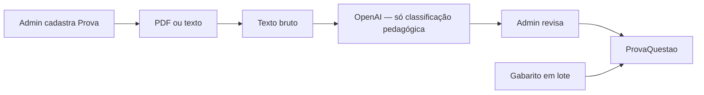

# Extração com IA — desafio e estratégia

## Dois níveis de dados

| Nível | Onde fica | Exemplos |
|--------|-----------|----------|
| **Prova** (registro admin) | Tabela `Prova` | Nome, banca/vestibular, ano, dia, caderno Azul/Tipo 1 |
| **Questão** (pedagógico) | Tabela `ProvaQuestao` | Número, área/bloco ENEM, matéria, assunto, conhecimento, dificuldade, gabarito |

O aluno, ao registrar o simulado, **escolhe a prova** — não repete vestibular/ano/caderno por questão.

## Planilha / CSV (por questão)

Colunas: `Número da Questão`, `Área/Bloco`, `Matéria`, `Assunto`, `Habilidade/Conhecimento Exigido`, `Nível de Dificuldade`, `Observações`, `Gabarito`.

Colunas antigas `Prova` e `Caderno` do GPT são **ignoradas** no import (use o cadastro da prova no admin).

Template: `docs/templates/prova-questoes.csv`

## Pipeline IA (v1)



A IA recebe o contexto da prova (nome, banca, ano, caderno) só como **referência**, sem repetir por linha.

## Prompt para GPT (CSV alinhado ao app)

```
Analise o caderno [anexar PDF].
A prova já está cadastrada como: ENEM 2025 — 1º dia Ciências da Natureza, caderno Azul.

Gere CSV com colunas exatamente:
Número da Questão,Área/Bloco,Matéria,Assunto,Habilidade/Conhecimento Exigido,Nível de Dificuldade,Observações,Gabarito

Uma linha por questão. Não repita nome da prova nem caderno nas linhas.
Gabarito vazio se não constar no material.
```

## Configuração

```env
OPENAI_API_KEY=sk-...
OPENAI_MODEL=gpt-4o-mini
```

## Limitações

| Desafio | Mitigação |
|---------|-----------|
| PDF escaneado | Cole texto ou CSV |
| ENEM 180q | Chunks (em evolução) |
| Gabarito separado | Update em lote no admin |
