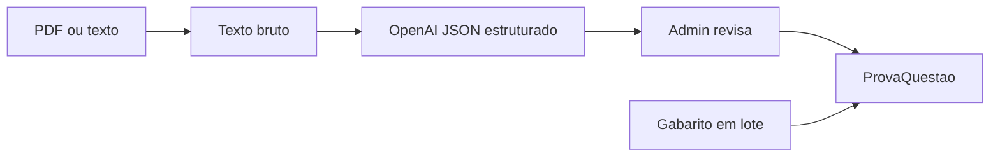

# Extração com IA — desafio e estratégia

## Sua planilha modelo (UFU 2026-2)

| Coluna | Preenchido por |
|--------|----------------|
| Prova | Admin (nome da prova) |
| Caderno | IA ou CSV |
| Número da Questão | IA (ordem no caderno) |
| Matéria | IA |
| Assunto | IA |
| Habilidade/Conhecimento Exigido | IA |
| Nível de Dificuldade | IA (estimativa) |
| Observações | IA |
| Gabarito | Admin depois (update por questão) |

## Pipeline implementado (v1)



1. Admin envia **PDF** ou cola **texto** em `/admin/provas/[id]`.
2. `POST /api/admin/provas/[id]/extrair` chama modelo com schema fixo.
3. **Pré-visualizar** → revisar tabela → **Aplicar**.
4. Gabarito oficial entra depois (lote `numero,letra`).

## Limitações honestas

| Desafio | Mitigação atual | Próximo passo |
|---------|-----------------|---------------|
| PDF escaneado (imagem) | Texto pode sair vazio | OCR (Tesseract / Vision API) |
| Provas longas 180q | Chunks de texto | Processar por blocos ENEM |
| Matéria errada | Revisão admin + CSV GPT | Fine-tune + mapa ENEM por faixa |
| Gabarito separado | Update em lote | Importar gabarito oficial CSV |

## Configuração

```env
OPENAI_API_KEY=sk-...
OPENAI_MODEL=gpt-4o-mini
```

Sem chave: use **Importar CSV** com a planilha que o GPT já gera (fluxo que você usa hoje).

## Prompt para GPT (gerar CSV igual à planilha)

Use quando não quiser PDF direto no app — resultado idêntico ao import CSV:

```
Analise o caderno de provas [anexar PDF].
Gere CSV com colunas exatamente:
Prova,Caderno,Número da Questão,Matéria,Assunto,Habilidade/Conhecimento Exigido,Nível de Dificuldade,Observações,Gabarito

Uma linha por questão. Prova=UFU 2026-2, Caderno=Tipo 1.
Gabarito vazio se não constar no material.
```
