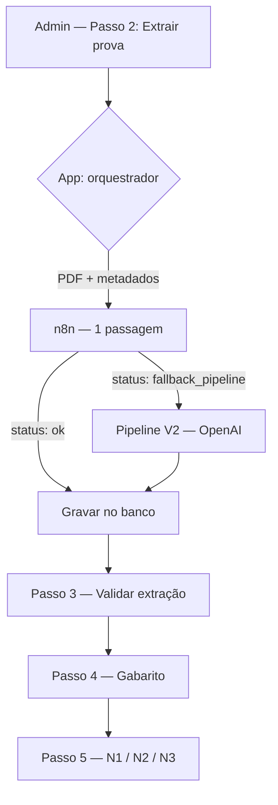

# Processo — Extração híbrida (n8n + Pipeline app)

Ciclo fechado de **extração pura** (sem classificação). Dois motores, um orquestrador, um contrato de gravação.

## Visão geral



| Motor | Papel | Quando usar |
|-------|--------|-------------|
| **n8n** | Fast path — parse determinístico, EN/ES com `indice_global` | PDF legível, marcadores `Questão N`, cobertura ≥ 85% |
| **Pipeline V2** | Slow path — IA, texto fragmentado | FAMERP, cobertura incompleta, n8n indisponível |

---

## Fases de implementação

### Fase 1 — Orquestração no app ✅

| # | Entrega | Arquivo / rota |
|---|---------|----------------|
| 1.1 | Cliente HTTP → webhook n8n | `src/lib/prova-extracao-n8n.ts` |
| 1.2 | Orquestrador (n8n → fallback pipeline) | `src/lib/prova-extracao-orquestrador.ts` |
| 1.3 | API única de extração | `POST /api/admin/provas/[id]/extrair-hibrido` |
| 1.4 | UI Passo 2 chama orquestrador | `admin-prova-pipeline-v2.tsx` |
| 1.5 | Variáveis de ambiente | `N8N_EXTRACAO_WEBHOOK_URL`, `N8N_EXTRACAO_WEBHOOK_SECRET` |

**Critério de aceite:** botão «Extrair prova» tenta n8n; se `fallback` ou falha, roda Pipeline V2; resposta indica `fonte: n8n | pipeline`.

### Fase 2 — Contrato n8n ✅

| # | Entrega | Onde |
|---|---------|------|
| 2.1 | Webhook POST (multipart PDF) | Workflow `PDF's` — nó `Webhook Extracao` |
| 2.2 | Extract PDF → Cria Prova (1 passagem) | Ramo API sem Sanitizar |
| 2.3 | Montar resposta padronizada | `scripts/n8n-montar-resposta-api.js` |
| 2.4 | Respond to Webhook | JSON com `status: ok \| fallback_pipeline` |
| 2.5 | IF API Path | Form → Switch (manual); Webhook → Montar Resposta → Respond |

**Resposta OK:**

```json
{
  "status": "ok",
  "fonte": "n8n",
  "metricas": { "total_validas": 86, "numeros_unicos": 80, "total_itens": 92 },
  "questoes": [
    {
      "indice_global": 9,
      "numero": 11,
      "opcao_lingua_estrangeira": "ingles",
      "enunciado": "...",
      "alternativas": { "A": "...", "B": "..." },
      "valido": true
    }
  ]
}
```

**Resposta fallback:**

```json
{
  "status": "fallback_pipeline",
  "motivo": "COBERTURA_INCOMPLETA",
  "metricas": { "total_validas": 0, "numeros_unicos": 71, "total_esperado": 80 }
}
```

### Fase 3 — Validação e fechamento

| # | Entrega |
|---|---------|
| 3.1 | App revalida cobertura antes de gravar (defesa em profundidade) |
| 3.2 | Passo 3 UI — relatório igual para n8n e pipeline |
| 3.3 | Testes manuais: VNSP (n8n), FAMERP (pipeline), EN/ES duplicado |
| 3.4 | Documentar URL do webhook no EasyPanel |

### Fase 4 — Classificação (fora do escopo de extração)

- N1 refatorado: IA escolhe catálogo **sem** exigir `areaBloco` pré-preenchido
- Remover remendos de área na extração (`secao` → só observação, não N1)

---

## Regras de ouro

1. **Extração pura** — só `ordemExtracao`, `numero`, enunciado, alternativas, variante EN/ES
2. **n8n não conserta FAMERP** — detecta incompletude → `fallback_pipeline`
3. **Camadas separadas** — Sanitizar (debug manual) ≠ Cria Prova (parse) ≠ Orquestrador (decisão)
4. **Um botão no admin** — duas engines, um contrato de persistência

---

## Mapeamento n8n → banco

| Campo n8n | Campo app |
|-----------|-----------|
| `indice_global` | `ordemExtracao` |
| `numero` | `numero` (pode repetir EN/ES) |
| `opcao_lingua_estrangeira` | `idiomaVariante` |
| `secao` | observação / metadado (não classificação) |

---

## Variáveis de ambiente

```env
# Webhook de extração de provas (workflow PDF's)
N8N_EXTRACAO_WEBHOOK_URL="https://infra-core-n8n-core.kxryyk.easypanel.host/webhook/coach-extracao-prova"
N8N_EXTRACAO_WEBHOOK_SECRET=""
```

Se `N8N_EXTRACAO_WEBHOOK_URL` estiver vazia, o orquestrador usa **somente** o Pipeline V2.
